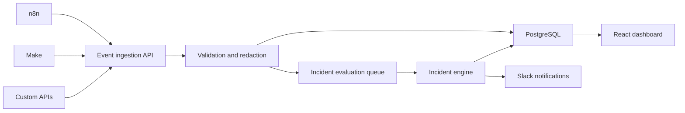

# OpenFlow MVP — Product Requirements Document

**Status:** Draft v0.1  
**Owner:** Austin Gabriel Diaz  
**Last updated:** July 23, 2026  
**Product type:** B2B SaaS / developer operations tool  
**Positioning:** Cross-platform business-process monitoring for automation agencies

## 1. Product summary

OpenFlow gives automation agencies one place to monitor business processes running across n8n, Make, and custom APIs.

It correlates technical workflow events into business-level process instances such as:

- Order fulfillment
- Lead qualification
- Client onboarding
- Invoice processing
- Support escalation

OpenFlow initially observes, detects, and explains incidents. It does not execute workflows or automatically modify customer systems.

## 2. Problem

Automation agencies manage workflows across multiple platforms and clients. Each platform provides its own logs, but there is no shared view of whether the complete business process succeeded.

An onboarding process might involve:

```text
Make receives payment
→ Custom API provisions account
→ n8n creates onboarding workspace
→ Gmail sends welcome email
→ Slack notifies operations
```

Each platform can report its own execution, but the agency cannot easily answer:

- Did the entire process complete?
- Which customer was affected?
- Which stage is missing?
- How long has the process been stuck?
- Has the client already been affected?
- Who is responsible for resolving it?

Failures are often discovered only after a client or customer complains.

## 3. Target customer

### Initial ideal customer

Automation agencies that:

- Manage at least five clients
- Operate 25 or more production workflows
- Use at least two automation platforms
- Handle revenue-sensitive or customer-facing processes
- Currently check execution dashboards manually
- Communicate automation incidents through Slack or email

### Primary user

**Automation operator**

Needs to detect, investigate, assign, and resolve workflow incidents across clients.

### Secondary user

**Agency owner**

Needs client-level reliability reporting and confidence that failures are detected before clients report them.

## 4. Product hypothesis

> If automation agencies can see cross-platform business-process failures in one incident inbox, they will detect problems faster, reduce manual checking, and provide more reliable service to clients.

The riskiest assumptions are:

- Cross-platform visibility is painful enough to pay for.
- Agencies will add lightweight instrumentation to existing workflows.
- Built-in platform alerts are insufficient.
- Agencies are comfortable sending limited workflow metadata to OpenFlow.

## 5. Goals

The MVP must:

- Monitor processes across n8n, Make, and custom HTTP services.
- Correlate events using a shared business identifier.
- Detect reported failures and missing expected stages.
- Present a unified incident inbox.
- Explain incidents in business language.
- Alert operators through Slack.
- Support multiple isolated client workspaces.
- Minimize sensitive data collection.
- Take less than 15 minutes to connect one workflow.

## 6. Non-goals

The MVP will not:

- Replace n8n, Make, Temporal, or other workflow runtimes.
- Execute arbitrary customer workflows.
- Automatically retry external actions.
- Provide a visual workflow builder.
- Support every automation platform.
- Store complete customer payloads by default.
- Use AI to resolve incidents automatically.
- Provide enterprise SSO or advanced billing.
- Guarantee regulatory compliance.

## 7. Core product concepts

| Concept      | Definition                                                  |
| ------------ | ----------------------------------------------------------- |
| Workspace    | An agency account                                           |
| Client       | A customer managed by the agency                            |
| Process      | A defined business process, such as onboarding              |
| Stage        | An expected step, such as `account_created`                 |
| Instance     | One occurrence of a process for an order, lead, or customer |
| Event        | A status update sent by an automation                       |
| Incident     | A failure, missing stage, duplicate, or SLA violation       |
| Business key | Identifier correlating events, such as `order_123`          |

## 8. MVP functionality

### 8.1 Event ingestion

OpenFlow provides a secure HTTP endpoint:

```text
POST /v1/events
```

Example event:

```json
{
  "eventId": "evt_01JZ5A8W9TQXM2YF7K3N6R4P1C",
  "processKey": "client-onboarding",
  "instanceKey": "customer_4821",
  "stage": "workspace_created",
  "status": "completed",
  "source": "n8n",
  "occurredAt": "2026-07-23T10:30:00Z",
  "metadata": {
    "clientId": "client_acme",
    "executionUrl": "https://n8n.example.com/execution/9281"
  }
}
```

Requirements:

- Each workspace receives an ingestion key.
- Duplicate event IDs are ignored safely.
- Payloads are validated against a documented schema.
- Unknown fields are discarded by default.
- Ingestion keys are stored as hashes.
- Rate limiting is applied per workspace.
- Accepted events return within 500 milliseconds under normal load.

### 8.2 Process definitions

Users define the expected stages of a process:

```text
payment_received
→ account_created
→ workspace_created
→ welcome_email_sent
```

Each stage can have:

- Display name
- Expected predecessor
- Maximum completion time
- Required or optional status
- Owning system
- Owning team

The MVP can use a simple form rather than a visual builder.

### 8.3 Process correlation

Events sharing the same `processKey` and `instanceKey` belong to one process instance.

OpenFlow must display:

- Business identifier
- Current process state
- Completed stages
- Missing stages
- Time spent in each stage
- Source systems
- Related incidents

### 8.4 Incident detection

The MVP detects four incident types:

1. **Reported failure**  
   A workflow sends an event with `status: "failed"`.

2. **Missing stage**  
   An expected stage does not arrive within its configured time.

3. **SLA violation**  
   The complete process exceeds its maximum duration.

4. **Unexpected sequence**  
   A later stage arrives before a required earlier stage.

Every incident contains:

- Client
- Process
- Instance
- Severity
- Affected stage
- Technical message
- Business explanation
- Source execution link
- Created time
- Assignment
- Resolution status

### 8.5 Incident inbox

Operators can:

- View open incidents across all clients.
- Filter by client, process, source, severity, and status.
- Assign an incident.
- Add an internal note.
- Mark it acknowledged or resolved.
- Open the source execution.
- View the complete cross-platform timeline.

### 8.6 Slack notifications

OpenFlow sends Slack alerts for new incidents.

Example:

> **Client onboarding delayed**  
> Acme customer `customer_4821` completed payment, but account provisioning has not occurred within 10 minutes.  
> Source: Custom API · Severity: High  
> View incident →

Users can configure:

- Slack webhook
- Minimum severity
- Client filtering
- Notification channel

### 8.7 Multi-client workspaces

Agency owners can:

- Create clients.
- Assign processes to clients.
- Invite operators.
- Restrict viewers to selected clients.
- View reliability metrics per client.

MVP roles:

- Owner
- Operator
- Viewer

### 8.8 Privacy and redaction

OpenFlow should collect operational metadata, not full business payloads.

Requirements:

- Metadata allowlist per process.
- Automatic redaction for fields matching `password`, `token`, `secret`, or `authorization`.
- Configurable 30-day event retention.
- Tenant isolation at the database level.
- Audit log for incident status and assignment changes.

## 9. Primary user flows

### Connect a process

1. User creates a client.
2. User creates a process.
3. User defines expected stages and timeouts.
4. OpenFlow generates an ingestion key and event examples.
5. User adds HTTP event calls to n8n or Make.
6. User sends a test event.
7. OpenFlow confirms that monitoring is active.

### Investigate an incident

1. OpenFlow detects a missing stage.
2. Slack notification is sent.
3. Operator opens the incident.
4. Operator reviews the cross-platform timeline.
5. Operator opens the source execution.
6. Operator fixes or retries it in the source platform.
7. A completion event arrives.
8. OpenFlow automatically resolves the incident.

## 10. Main screens

### Overview

- Active processes
- Process instances today
- Completion rate
- Open incidents
- Median detection time
- Incidents by client

### Processes

- Process name
- Client
- Connected platforms
- Expected stages
- Recent completion rate
- Monitoring status

### Incident inbox

- Severity
- Business process
- Affected instance
- Client
- Missing or failed stage
- Age
- Assignment

### Incident detail

- Business summary
- Technical error
- Cross-platform timeline
- Source execution links
- Notes
- Assignment
- Resolution controls

### Client report

- Total process instances
- Completion rate
- Incidents detected
- Incidents resolved
- Median resolution time
- Most unreliable stage

## 11. Technical architecture



Suggested stack:

- React and Vite
- TypeScript
- Fastify
- PostgreSQL
- BullMQ and Redis
- Zod
- Vitest
- Playwright
- Docker Compose
- Vercel for the dashboard
- Railway, Fly.io, or Render for persistent backend services

## 12. Initial repository structure

```text
openflow/
├── apps/
│   ├── api/
│   ├── worker/
│   └── dashboard/
├── packages/
│   └── contracts/
├── database/
│   └── migrations/
├── tests/
├── docker-compose.yml
├── package.json
├── README.md
└── OPENFLOW_PRD.md
```

## 13. Initial data model

The first implementation should include:

### `workspaces`

- `id`
- `name`
- `ingestion_key_hash`
- `created_at`

### `clients`

- `id`
- `workspace_id`
- `name`
- `created_at`

### `processes`

- `id`
- `client_id`
- `key`
- `name`
- `sla_seconds`
- `created_at`

### `process_stages`

- `id`
- `process_id`
- `key`
- `name`
- `position`
- `required`
- `timeout_seconds`
- `source`

### `process_instances`

- `id`
- `process_id`
- `instance_key`
- `status`
- `started_at`
- `completed_at`
- `updated_at`

### `events`

- `id`
- `workspace_id`
- `process_instance_id`
- `external_event_id`
- `stage`
- `status`
- `source`
- `metadata`
- `occurred_at`
- `received_at`

### `incidents`

- `id`
- `process_instance_id`
- `incident_type`
- `severity`
- `status`
- `affected_stage`
- `technical_message`
- `business_message`
- `assigned_to`
- `created_at`
- `acknowledged_at`
- `resolved_at`

### `incident_notes`

- `id`
- `incident_id`
- `author_id`
- `body`
- `created_at`

## 14. Non-functional requirements

### Reliability

- Event ingestion must be idempotent.
- Database writes must preserve event ordering information.
- Incident evaluation jobs must be retryable.
- Failed incident evaluation jobs must remain inspectable.

### Performance

- Event ingestion response target: under 500 milliseconds at normal pilot load.
- New events should appear in the dashboard within 10 seconds.
- Incident notifications should be sent within one minute of detection.

### Security

- No secrets may be stored in source control.
- Ingestion credentials must be hashed at rest.
- All queries must be scoped to a workspace.
- Sensitive metadata must be redacted before persistence.
- Source execution URLs must be treated as potentially sensitive.
- Administrative changes must be recorded in an audit trail.

### Accessibility

- Dashboard workflows must be keyboard accessible.
- Status must not be communicated through color alone.
- All forms must have programmatic labels and useful validation messages.
- Incident severity and state changes must be announced appropriately to assistive technology.

## 15. Success metrics

### Product activation

- User connects their first process within 15 minutes.
- At least 70% of registered design partners successfully send an event.
- At least three processes are connected per activated workspace.

### Product value

- At least five genuine incidents are detected during the pilot.
- At least 80% of incidents are detected before a client reports them.
- Fewer than 10% of incidents are false positives.
- Operators return to the dashboard weekly.
- Median incident detection time is below five minutes.

### Commercial validation

- Ten agency interviews are completed.
- Three agencies agree to become design partners.
- Two agencies connect production workflows.
- At least one agency pays for the pilot.

## 16. Validation and kill criteria

Pause or reposition the product if:

- Fewer than three of ten agencies report this problem occurring monthly.
- Agencies refuse to instrument existing workflows.
- Connecting one process consistently takes longer than 30 minutes.
- Built-in platform alerts already satisfy most users.
- False-positive incidents exceed 20%.
- No design partner will pay after receiving useful incident detection.

## 17. Delivery plan

### Phase 0 — Discovery: one week

- Interview 10 automation agencies.
- Collect recent incident examples.
- Validate terminology and willingness to instrument workflows.
- Secure three design partners.

### Phase 1 — Telemetry: two weeks

- Authentication and workspaces
- Client and process creation
- Event ingestion
- Process correlation
- Timeline interface

### Phase 2 — Incidents: two weeks

- Failure detection
- Missing-stage detection
- SLA rules
- Incident inbox
- Slack notifications

### Phase 3 — Agency support: two weeks

- Multi-client separation
- Roles
- Client reports
- Redaction
- Retention controls

### Phase 4 — Pilot: two to four weeks

- Connect production workflows.
- Measure false positives.
- Improve onboarding.
- Test pricing.
- Decide whether to add recovery functionality.

## 18. Pricing hypothesis

Pricing should be tested rather than finalized.

Possible pilot plans:

- **Solo:** $49/month, five monitored processes
- **Agency:** $199/month, 25 monitored processes and five clients
- **Agency Pro:** $499/month, 100 processes and client reporting

Usage overages could eventually be based on process instances or events.

## 19. Future roadmap

Only after validating the monitoring product:

- Zapier connector
- Email and Microsoft Teams alerts
- Automatic incident grouping
- Client-facing status pages
- Suggested recovery playbooks
- Approval-based replay
- Reconciliation checks
- Compensating actions
- AI-generated incident summaries
- Anomaly detection
- White-label agency reports
- Service-level agreements
- Self-hosted deployment

## 20. MVP launch definition

The MVP is ready for a design partner when an agency can:

1. Create a client and process.
2. Instrument one n8n and one Make workflow.
3. See both workflows in one process timeline.
4. Receive an incident when a required stage is missing.
5. Open the original execution.
6. Resolve the failure.
7. See the incident close automatically.
8. Generate a basic client reliability report.

That is the smallest version that tests the actual business opportunity. Automatic retries, workflow execution, and AI remediation remain outside the MVP until customers prove they need them.

## 21. First implementation milestone

The first development task should complete only the foundation and event-ingestion vertical slice:

1. Scaffold the npm workspace.
2. Add `apps/api`, `apps/worker`, `apps/dashboard`, and `packages/contracts`.
3. Start PostgreSQL and Redis with Docker Compose.
4. Create migrations for workspaces, clients, processes, stages, instances, and events.
5. Implement the shared Zod event contract.
6. Implement `POST /v1/events`.
7. Correlate events into process instances.
8. Ignore duplicate event IDs safely.
9. Allowlist metadata and redact sensitive fields.
10. Add unit and integration tests.
11. Document local setup and architectural decisions.

The milestone is complete when:

- `npm install` succeeds.
- Docker Compose starts PostgreSQL and Redis.
- Migrations run successfully.
- A valid event can be accepted and stored.
- Duplicate event IDs do not create duplicate records.
- Sensitive metadata is redacted.
- Tests pass.
- The README explains how to run and verify the vertical slice.
