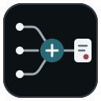
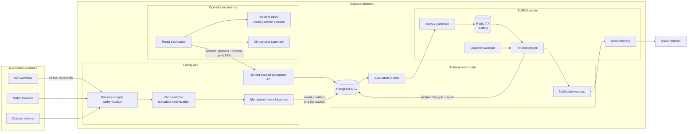

<p align="center">
  
</p>

<h1 align="center">Outtrace</h1>

<p align="center">
  <strong>Trace the process beyond the workflow.</strong><br />
  Cross-platform business-process observability for automation agencies.
</p>

<p align="center">
  <a href="package.json"></a>
  <a href="LICENSE"></a>
  <a href="https://github.com/ostenmatrixx/outtrace/commits/main"></a>
  <a href="https://github.com/ostenmatrixx/outtrace/issues"></a>
</p>

<p align="center">
  <a href="https://nodejs.org/"></a>
  <a href="https://react.dev/"></a>
  <a href="https://www.typescriptlang.org/"></a>
  <a href="https://vite.dev/"></a>
  <a href="https://fastify.dev/"></a>
  <a href="https://zod.dev/"></a>
</p>

<p align="center">
  <a href="https://www.postgresql.org/"></a>
  <a href="https://redis.io/"></a>
  <a href="https://docs.bullmq.io/"></a>
  <a href="https://vitest.dev/"></a>
  <a href="https://docs.docker.com/compose/"></a>
</p>

<p align="center">
  <a href="#what-it-does">What it does</a> ·
  <a href="#production-engineering">Production engineering</a> ·
  <a href="#tech-stack">Tech stack</a> ·
  <a href="#architecture">Architecture</a> ·
  <a href="#local-development">Local development</a>
</p>

## What it does

Outtrace turns workflow telemetry into an incident timeline that teams can operate across clients,
tools, and environments.

- Connects n8n, Make, and custom services through one authenticated event contract.
- Correlates stage events into a client, process, instance, and source-execution timeline.
- Detects reported failures, missing stages, unexpected sequences, and SLA violations.
- Gives owners and operators an incident inbox with assignment, notes, lifecycle controls, Slack
  alerts, and genuine or false-positive feedback.
- Provides client isolation, role-based access, configurable metadata policies, retention, and a
  fixed 28-day production-pilot summary.

## Production engineering

- Strict Zod contracts reject invalid input while recursive metadata minimization removes sensitive,
  unknown, nested, and oversized values before persistence.
- Process-scoped ingestion credentials reduce blast radius. Only credential hashes are stored, and
  authentication uses constant-time secret comparison.
- PostgreSQL constraints make event ingestion idempotent, while event persistence and evaluation
  outbox writes share one transaction.
- Stable BullMQ job IDs, retry policies, bounded backoff, and deadline sweeps make asynchronous
  incident evaluation resilient to duplicate delivery and service restarts.
- Tenant and client access are enforced by the API on every operational route; the browser is never
  treated as the security boundary.
- Health checks expose PostgreSQL and Redis state, and the verification suite covers formatting,
  linting, type safety, unit tests, isolated-schema integration tests, and production builds.

## Tech stack

| Layer             | Technology                                          |
| ----------------- | --------------------------------------------------- |
| Dashboard         | React 19, TypeScript 5.9, Vite 8, GSAP              |
| API               | Node.js 22, Fastify 5, Zod 4                        |
| Background worker | BullMQ 5, Redis 7.4                                 |
| Persistence       | PostgreSQL 17, node-postgres                        |
| Testing           | Vitest 4, Testing Library                           |
| Workspace/tooling | npm workspaces, Docker Compose, ESLint 10, Prettier |

## Architecture

Outtrace separates synchronous ingestion from asynchronous incident evaluation. PostgreSQL remains
the system of record; Redis carries retryable BullMQ work, while the API remains the tenant and
client security boundary.



The API authenticates and validates each event, minimizes metadata, and commits the event plus an
evaluation-outbox row to PostgreSQL. The worker publishes those rows to BullMQ, evaluates incident
conditions idempotently, and records notification work for optional Slack delivery. The dashboard
reads the same tenant-scoped API for incident operations, agency administration, and pilot evidence.
Detailed tradeoffs are documented in the [architecture decision records](docs/architecture/).

## Local Development

### Requirements

- Node.js 22 or newer
- npm 10 or newer
- Docker with Docker Compose

### Quick start

1. Create the local environment file and install dependencies.

   ```bash
   nvm use
   cp .env.example .env
   npm install
   ```

2. Start PostgreSQL and Redis.

   ```bash
   docker compose up -d --wait
   docker compose ps
   ```

3. Apply migrations and create the opt-in development workspace, client, process, and hashed
   ingestion credential.

   ```bash
   npm run db:migrate
   ```

   The checked-in example sets `OUTTRACE_SEED_DEVELOPMENT=true` and uses a public, local-only test
   secret. The API refuses this seed when `NODE_ENV=production`. Never reuse the example secret.

4. Start the API, worker, and dashboard together.

   ```bash
   npm run dev
   ```

   The default endpoints are:

   - API: `http://localhost:3000`
   - API health: `http://localhost:3000/health`
   - Dashboard: the Vite URL printed in the terminal, normally `http://localhost:5173`

   Open the dashboard with `DEV_OPERATOR_KEY_ID` and `DEV_OPERATOR_KEY`. The development seed
   creates a workspace owner with this credential. The dashboard keeps credentials in the current
   browser tab only; they are never compiled into its bundle.

The development seed remains the fastest local setup and uses its legacy workspace ingestion key.
Production pilot integrations should use an owner-created process and its process-scoped
credential.

## Connect a pilot process

Create the complete definition as an owner. Stage array order is evaluation order:

```bash
curl --request POST http://localhost:3000/v1/processes \
  --header 'content-type: application/json' \
  --header 'x-outtrace-operator-key-id: REPLACE_WITH_OPERATOR_KEY_ID' \
  --header 'x-outtrace-operator-key: REPLACE_WITH_OPERATOR_KEY' \
  --data '{
    "clientId": "client_REPLACE_ME",
    "key": "client-onboarding-sandbox",
    "name": "Client onboarding sandbox",
    "environment": "sandbox",
    "slaSeconds": 1800,
    "metadataAllowlist": ["executionId", "executionUrl", "externalReference"],
    "stages": [
      {
        "key": "payment_received",
        "name": "Payment received",
        "required": true,
        "timeoutSeconds": 300,
        "source": "make",
        "owningTeam": "Revenue operations"
      },
      {
        "key": "workspace_created",
        "name": "Workspace created",
        "required": true,
        "timeoutSeconds": 600,
        "source": "n8n",
        "owningTeam": "Automation"
      }
    ]
  }'
```

The `201` response contains the process, ordered stages, and a process-scoped `credential` with
`keyId`, plaintext `key`, and `createdAt`. The plaintext is returned once. Copy it directly to the
source platform's encrypted credential or secret store; it cannot be retrieved later. Process key,
environment, and stages are immutable in this pilot, so create a replacement process for a material
definition change. New processes start with `lifecycleStatus: "active"`. After a replacement is
connected, an owner can archive the superseded definition with
`PATCH /v1/processes/:processId`.

Start in `sandbox`. Send at least one complete successful instance through every required stage,
then create a separate `production` process and credential. A process is
`awaiting_first_event` until Outtrace persists its first non-duplicate event. That event persists
`connectedAt`; later newly persisted events update `lastEventAt`, and both timestamps survive
service restarts.

All platforms use the event contract shown below. Configure:

- n8n with an HTTP Request node and encrypted n8n credential for the two Outtrace headers;
- Make with an HTTP Make a request module and secured connection or secret variables; or
- a custom service with the header values loaded from its runtime secret store.

Use placeholders or environment variables in code and documentation:

```bash
curl --request POST "${OUTTRACE_API_BASE_URL}/v1/events" \
  --header 'content-type: application/json' \
  --header "x-outtrace-key-id: ${OUTTRACE_PROCESS_KEY_ID}" \
  --header "x-outtrace-key: ${OUTTRACE_PROCESS_KEY}" \
  --data '{
    "eventId": "evt_unique_for_this_stage_attempt",
    "processKey": "client-onboarding-sandbox",
    "instanceKey": "customer_4821_sandbox",
    "stage": "workspace_created",
    "status": "completed",
    "source": "n8n",
    "occurredAt": "2026-07-25T08:00:00Z",
    "metadata": {
      "executionId": "sandbox-run-42",
      "executionUrl": "https://automation.example/executions/42"
    }
  }'
```

The credential is accepted only when the payload's `processKey` matches its process. Use one stable
`instanceKey` across the complete business occurrence and one unique, retry-stable `eventId` per
stage attempt. Never put these credentials in source code, workflow names, logs, screenshots,
metadata, or `VITE_*` variables.

The complete onboarding, canary, evidence, and rollback procedure is in the
[Phase 4 pilot runbook](docs/phase-4-pilot.md).

## Send a test event

For a local smoke test using the existing development seed and values from `.env.example`:

```bash
curl --request POST http://localhost:3000/v1/events \
  --header 'content-type: application/json' \
  --header 'x-outtrace-key-id: dev_local' \
  --header 'x-outtrace-key: outtrace_dev_ingestion_key' \
  --data '{
    "eventId": "evt_01JZ5A8W9TQXM2YF7K3N6R4P1C",
    "processKey": "client-onboarding",
    "instanceKey": "customer_4821",
    "stage": "workspace_created",
    "status": "completed",
    "source": "n8n",
    "occurredAt": "2026-07-23T10:30:00Z",
    "metadata": {
      "clientId": "client_acme",
      "executionUrl": "https://n8n.example.com/execution/9281",
      "token": "this value is never stored",
      "unknownField": "this field is discarded"
    },
    "unknownTopLevel": "discarded by the contract"
  }'
```

A first request returns HTTP 202 with a stable process-instance identifier:

```json
{
  "eventId": "evt_01JZ5A8W9TQXM2YF7K3N6R4P1C",
  "processInstanceId": "pi_...",
  "accepted": true,
  "duplicate": false
}
```

Sending the same event again returns HTTP 200 with `"duplicate": true` and the same
`processInstanceId`; it does not add another event row. Make and custom-service payloads use the
same shape with `"source": "make"` or `"source": "custom"`.

Inspect the stored, minimized record:

```bash
docker compose exec postgres sh -lc \
  'psql -U "$POSTGRES_USER" -d "$POSTGRES_DB" -c "
    SELECT external_event_id, process_instance_id, metadata
    FROM events
    WHERE external_event_id = '\''evt_01JZ5A8W9TQXM2YF7K3N6R4P1C'\'';
  "'
```

This returns one event row. Sending another event with the same `processKey` and `instanceKey`
returns the same process-instance ID.

## Development commands

| Command                       | Purpose                                                    |
| ----------------------------- | ---------------------------------------------------------- |
| `npm run dev`                 | Run the API, worker, and dashboard                         |
| `npm run db:migrate`          | Apply pending SQL migrations and optional development seed |
| `npm run format`              | Format source and documentation                            |
| `npm run format:check`        | Verify formatting                                          |
| `npm run lint`                | Run ESLint                                                 |
| `npm run typecheck`           | Type-check every workspace                                 |
| `npm test`                    | Run unit tests                                             |
| `npm run test:integration`    | Run PostgreSQL integration tests                           |
| `npm run build`               | Build contracts and all applications                       |
| `npm run workspace:bootstrap` | Create a production workspace and initial owner once       |
| `npm run verify`              | Run the complete Phase 4 quality suite                     |

The integration command loads `TEST_DATABASE_URL` from the root `.env` and fails if it is missing
or unreachable. It creates a random PostgreSQL schema, migrates and tests inside it, then removes
it. `npm run verify` therefore requires PostgreSQL to be running. Keep tests away from databases
with valuable data.

Applied migration files are immutable: create a new numbered migration instead of editing one
already applied. Re-running the development seed upserts its known workspace, client, and process
and updates the seeded credential hash.

## Environment reference

`DEV_INGESTION_KEY`, `DEV_OPERATOR_KEY`, generated member access keys, generated process ingestion
keys, and database passwords are secrets. Variables prefixed with `VITE_` are compiled into browser
code and must never contain credentials.

| Variable                                                  | Consumer          | Required/default                 | Notes                                             |
| --------------------------------------------------------- | ----------------- | -------------------------------- | ------------------------------------------------- |
| `POSTGRES_DB`, `POSTGRES_USER`, `POSTGRES_PASSWORD`       | Compose           | Local defaults in `.env.example` | PostgreSQL container bootstrap                    |
| `POSTGRES_PORT`                                           | Compose           | `5432`                           | Loopback-only host port                           |
| `DATABASE_URL`, `DATABASE_URL_FILE`                       | API/worker        | One required                     | Direct local URL or mounted secret file           |
| `TEST_DATABASE_URL`                                       | Integration tests | Required by integration/verify   | Must permit temporary schemas                     |
| `REDIS_PORT`                                              | Compose           | `6379`                           | Loopback-only host port                           |
| `REDIS_URL`, `REDIS_URL_FILE`                             | API/worker        | One required                     | Direct local URL or mounted secret file           |
| `NODE_ENV`                                                | API/migrations    | `development`                    | Development seeding is rejected in `production`   |
| `API_HOST`, `API_PORT`                                    | API               | `127.0.0.1`, `3000`              | Listen address and port                           |
| `API_CORS_ORIGIN`                                         | API               | `http://localhost:5173`          | Must exactly match the dashboard origin           |
| `API_TRUST_PROXY`                                         | API               | `false`                          | Enable only behind the trusted production ingress |
| `LOG_LEVEL`                                               | API               | `info`                           | Fastify log level                                 |
| `OUTTRACE_SEED_DEVELOPMENT`                               | Migrations        | `false` in code                  | Enables the local-only seed                       |
| `DEV_INGESTION_KEY_ID`, `DEV_INGESTION_KEY`               | Seed              | Required when seed enabled       | Public example values are local-only              |
| `DEV_OPERATOR_KEY_ID`, `DEV_OPERATOR_KEY`                 | Seed/dashboard    | Required when seed enabled       | Hashed operator credential for incident APIs      |
| `DEV_WORKSPACE_ID`, `DEV_CLIENT_ID`                       | Seed              | Required when seed enabled       | Stable local identifiers                          |
| `DEV_PROCESS_ID`, `DEV_PROCESS_KEY`                       | Seed              | Required when seed enabled       | Stable local process                              |
| `WORKER_CONCURRENCY`                                      | Worker            | `5`, range 1–100                 | Parallel BullMQ jobs                              |
| `WORKER_LOCK_DURATION_MS`                                 | Worker            | `30000`, range 5000–600000       | BullMQ lock duration                              |
| `WORKER_SHUTDOWN_TIMEOUT_MS`                              | Worker            | `30000`, range 100–120000        | Total shutdown deadline                           |
| `REDIS_CONNECT_TIMEOUT_MS`                                | Worker            | `10000`, range 100–120000        | Initial Redis connection timeout                  |
| `PHASE_2_POLL_INTERVAL_MS`                                | Worker            | `1000`, range 250–60000          | Evaluation/notification outbox poll interval      |
| `PHASE_2_SWEEP_INTERVAL_MS`                               | Worker            | `30000`, range 1000–300000       | Missing-stage and SLA sweep interval              |
| `RETENTION_SWEEP_INTERVAL_MS`                             | Worker            | `3600000`, range 60000–86400000  | Expired event cleanup interval                    |
| `RETENTION_BATCH_SIZE`                                    | Worker            | `1000`, range 100–10000          | Maximum events deleted per statement              |
| `RETENTION_MAX_BATCHES_PER_SWEEP`                         | Worker            | `10`, range 1–100                | Per-workspace cleanup work bound                  |
| `IDEMPOTENCY_RETENTION_DAYS`                              | Worker            | `365`, range 30–3650             | Retry-receipt retention after raw event deletion  |
| `OUTBOX_RETENTION_DAYS`                                   | Worker            | `90`, range 7–3650               | Completed outbox record retention                 |
| `SLACK_WEBHOOK_URLS_JSON`, `SLACK_WEBHOOK_URLS_JSON_FILE` | Worker            | Empty mapping                    | Workspace-to-HTTPS-webhook secret mapping         |
| `SLACK_MINIMUM_SEVERITY`                                  | Worker            | `high`                           | `critical`, `high`, `medium`, or `low`            |
| `DASHBOARD_BASE_URL`                                      | Worker            | `http://localhost:5173`          | Base URL included in Slack incident links         |
| `WORKER_HEALTH_HOST`, `WORKER_HEALTH_PORT`                | Worker            | `127.0.0.1`, `3001`              | Worker liveness/readiness listener                |
| `VITE_API_BASE_URL`                                       | Dashboard         | `http://localhost:3000`          | Public browser-visible API origin                 |

## Repository layout

```text
apps/
  api/        Fastify ingestion API, migration runner, and persistence service
  worker/     BullMQ evaluation worker, deadline sweeper, and Slack delivery
  dashboard/  React/Vite incident and agency operations workspace
packages/
  contracts/  Shared Zod request, response, health, error, and queue contracts
database/
  migrations/ Explicit PostgreSQL migrations
docs/
  architecture/ Architecture decisions
```

## Ingestion behavior

The shared contract accepts the initial sources `n8n`, `make`, and `custom`, and statuses `started`,
`completed`, and `failed`. Unknown top-level fields are stripped.

Each process owns its metadata allowlist. The development process starts with these eligible fields:

- `clientId`
- `executionId`
- `executionUrl`
- `externalReference`
- `environment`
- `region`

Owners can change that allowlist from the dashboard, up to 32 operational keys per process.
Sensitive keys are recursively replaced before the process allowlist is applied. Matching is
case-insensitive for password, passwd, token, secret, authorization, apiKey, api_key, cookie, and
session. Persisted allowlisted values are bounded operational strings; arrays, objects, oversized
values, invalid execution URLs, and unknown metadata fields are discarded.

## Authentication, roles, and tenant isolation

Clients send a non-secret key identifier in `x-outtrace-key-id` and its secret in
`x-outtrace-key`. PostgreSQL stores only the SHA-256 secret hash. The API hashes the presented
secret and performs constant-time comparison.

Owner-created processes receive process-scoped ingestion credentials. Their plaintext secret is
returned once at creation or issuance and is never returned by a read endpoint. A scoped credential
can submit events only for its exact process key. Issuing another credential with
`POST /v1/processes/:processId/credentials` adds a new valid credential by default. Pass
`{"revokeExisting":true}` for an atomic replacement, or canary the new key and revoke the prior key
explicitly. Legacy workspace-scoped credentials remain available only in development and test;
production accepts member operator keys and process-scoped ingestion keys.

Authentication resolves the workspace and, when present, the credential's process before event
persistence. Process lookup, event idempotency, and all persisted relationships are scoped to that
workspace. Process keys are unique per workspace because the event contract contains no independent
client selector.

The ingestion route is rate-limited before database persistence. The limit is keyed from the
request origin and ingestion-key identifier; `429` responses include retry guidance without
echoing the identifier.

Never place an ingestion key in `VITE_*` variables or dashboard source. Variables prefixed with
`VITE_` are compiled into browser assets.

Dashboard requests use a separate member access key. Only a key identifier and SHA-256 secret hash
are stored. The invitation response reveals the generated secret once. The roles are:

- `owner`: administer clients, members, process definitions and policies, credentials, retention,
  reports, pilot evidence, and incidents;
- `operator`: operate and classify incidents and view all workspace clients, reports, and pilot
  evidence; and
- `viewer`: read incidents and reports only for explicitly assigned clients.

The API enforces role and client access on every route. Hiding controls in the dashboard is a
usability measure, not the security boundary. The legacy development operator credential resolves
as the seeded owner so existing local setups can migrate without losing access.

## Persistence guarantees

- `(process_id, instance_key)` is unique, so correlated events share one process instance even under
  concurrent requests.
- `(workspace_id, external_event_id)` has a lightweight idempotency receipt, so raw-event retention
  cannot recreate an event or collide with a longer-lived outbox row. Receipts default to a bounded
  365-day horizon and are pruned only after the raw event and evaluation outbox are gone.
- Correlation, event insertion, and instance-state changes occur in one PostgreSQL transaction.
- Out-of-order events remain in the timeline, `started_at` tracks the earliest event, and current
  state uses `occurredAt` plus external event ID as a deterministic tie-breaker.
- Process creation stores its complete ordered stage definition and credential atomically.
- The first persisted non-duplicate event fixes `connectedAt`; later newly persisted events advance
  `lastEventAt` without changing the original connection time.
- Database errors are converted to safe structured responses; SQL, credentials, and stack traces are
  not returned.

## API responses

| HTTP  | Code or response          | Meaning                                                  |
| ----- | ------------------------- | -------------------------------------------------------- |
| `202` | ingestion response        | A new event was accepted                                 |
| `200` | ingestion response        | A duplicate was accepted idempotently                    |
| `200` | health response           | Health is `ok` or `degraded`; inspect dependency states  |
| `400` | `INVALID_PAYLOAD`         | Malformed JSON, invalid contract, or unsupported source  |
| `400` | `UNSUPPORTED_STATUS`      | Status is not `started`, `completed`, or `failed`        |
| `401` | `AUTHENTICATION_REQUIRED` | One or both ingestion headers are missing                |
| `401` | `AUTHENTICATION_INVALID`  | The key identifier or secret is invalid                  |
| `403` | `AUTHORIZATION_FORBIDDEN` | The role or client assignment does not permit the action |
| `404` | `UNKNOWN_PROCESS`         | Process key is absent from the authenticated workspace   |
| `409` | `RESOURCE_CONFLICT`       | The requested workspace change violates a constraint     |
| `429` | rate-limit error          | Too many ingestion attempts; retry later                 |
| `503` | `DATABASE_FAILURE`        | Persistence failed; retry with the same `eventId`        |
| `500` | `INTERNAL_ERROR`          | Safe unexpected-error response                           |

Errors use one envelope:

```json
{
  "error": {
    "code": "INVALID_PAYLOAD",
    "message": "The event payload is invalid.",
    "details": {
      "issues": [{ "path": ["eventId"], "message": "Invalid input" }]
    }
  }
}
```

## Incident detection and delivery

`GET /health` reports API status and separate PostgreSQL/Redis reachability. `GET /live` is the
process liveness probe, while `GET /ready` returns `503` until both dependencies are reachable.
Dependency failures produce a degraded diagnostic result, which the dashboard exposes with text and
icons rather than color alone.

Every newly persisted event writes an evaluation-outbox row in the same PostgreSQL transaction.
The worker publishes pending rows to BullMQ with stable job IDs and retry policy, then marks them
published. A crash between Redis publication and the database update is safe because BullMQ
deduplicates the stable job ID and incident evaluation is idempotent.

The incident engine detects:

- `reported_failure` when the latest event for a stage is failed;
- `unexpected_sequence` when a stage arrives while a required predecessor is absent;
- `missing_stage` after a required stage exceeds its timeout from process start or predecessor
  completion; and
- `sla_violation` when an incomplete process exceeds its configured duration.

The deadline sweep detects time-based incidents even when no new event arrives. When completion
events clear a failure, missing stage, sequence gap, or SLA breach, the related incident resolves
automatically. Operator-resolved incidents stay resolved until a distinct condition is detected.
New/reopened incidents write a separate notification outbox. Slack delivery is retried with bounded
backoff and retains attempt/error state for inspection.

## Incident API

Operational endpoints require `x-outtrace-operator-key-id` and `x-outtrace-operator-key`; queries
are always scoped to the authenticated workspace.

| Method  | Endpoint                             | Purpose                                          |
| ------- | ------------------------------------ | ------------------------------------------------ |
| `GET`   | `/v1/incidents`                      | List/filter incidents                            |
| `GET`   | `/v1/incidents/:incidentId`          | Read business context, notes, and event timeline |
| `PATCH` | `/v1/incidents/:incidentId`          | Assign, acknowledge, or resolve                  |
| `POST`  | `/v1/incidents/:incidentId/notes`    | Add an internal note                             |
| `PUT`   | `/v1/incidents/:incidentId/feedback` | Classify genuine or false-positive evidence      |

List filters include `status`, `severity`, `type`, `clientId`, `processId`, and `source`. Assignment,
status changes, automatic lifecycle changes, and notes produce tenant-scoped audit records.

Owners and operators with access to the incident's client can upsert feedback. `false_positive`
requires `timeout_too_short`, `stage_not_required`, `expected_sequence_variation`,
`test_or_duplicate_traffic`, or `other`; `genuine` accepts no false-positive reason. An optional
note can add evidence. Feedback is independent of acknowledgement and resolution: a verdict never
resolves an incident, and automatic lifecycle changes never erase the verdict. Each update appends
a `feedback_recorded` audit entry.

## Agency API

All endpoints require the operator/member headers used by the incident API.

| Method  | Endpoint                                                    | Role/access              | Purpose                                   |
| ------- | ----------------------------------------------------------- | ------------------------ | ----------------------------------------- |
| `GET`   | `/v1/session`                                               | Any member               | Resolve role and visible client scope     |
| `GET`   | `/v1/clients`                                               | Any member               | List visible clients                      |
| `POST`  | `/v1/clients`                                               | Owner                    | Create a client boundary                  |
| `GET`   | `/v1/clients/:clientId/report`                              | Assigned client or above | Read lifetime reliability metrics         |
| `GET`   | `/v1/members`                                               | Owner                    | List members and access state             |
| `POST`  | `/v1/members`                                               | Owner                    | Invite a member and issue a key once      |
| `PATCH` | `/v1/members/:memberId`                                     | Owner                    | Change role, status, or client access     |
| `POST`  | `/v1/members/:memberId/credentials/rotate`                  | Owner                    | Rotate a member key atomically            |
| `GET`   | `/v1/processes`                                             | Any member               | List processes and connection evidence    |
| `POST`  | `/v1/processes`                                             | Owner                    | Create process, stages, and one-time key  |
| `POST`  | `/v1/processes/:processId/credentials`                      | Owner                    | Issue another one-time process credential |
| `GET`   | `/v1/processes/:processId/credentials`                      | Owner                    | List process credential metadata          |
| `POST`  | `/v1/processes/:processId/credentials/:credentialId/revoke` | Owner                    | Revoke one process key                    |
| `PATCH` | `/v1/processes/:processId`                                  | Owner                    | Assign client, lifecycle, or allowlist    |
| `GET`   | `/v1/workspace/settings`                                    | Owner                    | Read event retention policy               |
| `PATCH` | `/v1/workspace/settings`                                    | Owner                    | Update event retention policy             |

Client reports include instance completion rate, incident counts, resolved incidents, median
resolution time, and the most unreliable stage. Owner changes and completed retention runs are
recorded in `workspace_audit_log`.

An owner archives or reactivates a process with:

```json
{
  "lifecycleStatus": "archived"
}
```

sent to `PATCH /v1/processes/:processId`. Archived processes retain their history but reject new
event ingestion, even with an existing process credential. Use `"active"` to reactivate one.
`GET /v1/processes` retains both states and exposes `lifecycleStatus`; only the pilot summary filters
archived processes out.

## Pilot summary

`GET /v1/pilot/summary` is available to owners and operators and accepts no date parameters. Its
incident-quality window is the server-fixed half-open interval
`[generatedAt - 28 days, generatedAt)`.

| Field                       | Definition                                                                    |
| --------------------------- | ----------------------------------------------------------------------------- |
| `incidentsDetected`         | Production-process incidents created in the quality window                    |
| `reviewedIncidents`         | Genuine plus false-positive incidents                                         |
| `unreviewedIncidents`       | Detected incidents without feedback                                           |
| `falsePositiveRate`         | False positives divided by reviewed incidents; `null` when none are reviewed  |
| `totalProcesses`            | All active production processes, regardless of creation date                  |
| `connectedProcesses`        | Active production processes with a persisted first non-duplicate event        |
| `connectionRate`            | Connected divided by total production processes; zero when there are none     |
| `medianSecondsToFirstEvent` | Median process-creation-to-connection time for connected production processes |

Always report reviewed and unreviewed counts with the false-positive rate. Dividing by all detected
incidents would hide missing reviews. Sandbox incidents do not contribute to signal-quality
metrics. Archived production processes retain their incident evidence, while only active
production processes contribute to activation. The summary also returns active production process
event counts, connection state, `connectedAt`, and `lastEventAt`. A process `eventCount` is the
number of raw events currently retained, so it can decrease under the workspace retention policy
and must not be used for billing.

## Phase 4 boundaries

- Owners can create process definitions, but process key, environment, stage order, and stage rules
  are immutable. Create a replacement process for material definition changes, then archive the
  superseded process.
- Owners can archive or reactivate a process. Archived processes reject ingestion and are excluded
  from pilot activation and its process list; their existing evidence remains available.
- A process credential is shown once and process-scoped. Owners can list credential metadata, issue
  a replacement, atomically revoke existing keys, or revoke one key with an audited reason.
- Invitations issue a one-time access key through the API; email delivery, password login, SSO, and
  automated account recovery remain future work. Member credentials support atomic rotation, and
  disabling a member immediately revokes access.
- Slack webhook secrets are configured outside the database and keyed by workspace. The worker
  claims pending rows before delivery and never sends one workspace through another workspace's
  destination.
- Client reports are lifetime summaries; date-range filtering and scheduled exports are not yet
  included. The separate pilot-quality view has one fixed rolling 28-day window.
- Retention removes expired raw events while preserving incidents, audit records, and summary
  entities.
- Pricing is tested through structured interviews using the PRD Solo ($49/month), Agency
  ($199/month), and Agency Pro ($499/month) hypotheses. Billing, checkout, plan enforcement, and
  overage metering are not included.
- Recovery is an evidence and decision experiment. Outtrace does not retry, replay, call, approve,
  compensate, or automatically remediate customer workflows.
- Local Compose runs PostgreSQL and Redis only. Hardened application images and the production
  topology are defined in `Dockerfile` and `docker-compose.production.yml`.
- A one-shot, audited bootstrap command creates each production workspace and its initial active
  owner without enabling a legacy workspace-wide ingestion key.
- `NODE_ENV=production` disables the legacy workspace-wide operator and ingestion credential
  fallbacks; production access uses revocable member and process credentials.
- Production secret-file handling, health/readiness probes, backups, restore drills, rollback, and
  incident response are documented in the [production runbook](docs/production-runbook.md).

## Troubleshooting

### Authentication fails locally

Confirm that `OUTTRACE_SEED_DEVELOPMENT=true` was set when `npm run db:migrate` ran and that both
headers match `DEV_INGESTION_KEY_ID` and `DEV_INGESTION_KEY`. Rerunning migrations is safe.

For the incident inbox, use `DEV_OPERATOR_KEY_ID` and `DEV_OPERATOR_KEY`. If an older local database
was seeded before Phase 2, rerun `npm run db:migrate` to populate the hashed operator credential and
default stage rules. Phase 3 also creates the development owner member during the same idempotent
seed.

### The process is unknown

The development seed creates the `DEV_PROCESS_KEY` from the environment. The request's
`processKey` must match it exactly and the process must belong to the authenticated workspace.

For an owner-created pilot process, the payload's `processKey` must also match the process bound to
the presented process credential. Sandbox and production definitions have distinct keys and should
use distinct credentials.

### A process credential was lost or exposed

An owner can issue an atomic replacement with
`POST /v1/processes/:processId/credentials` and `{"revokeExisting":true}`. For a planned no-downtime
rotation, issue without revocation, canary the replacement, and then revoke the prior credential by
ID. If a secret may be exposed, revoke it immediately and confirm the old key returns `401` before
resuming. The full response procedure is in the
[Phase 4 pilot runbook](docs/phase-4-pilot.md).

### Health is degraded

Run `docker compose ps` and inspect service logs with:

```bash
docker compose logs postgres redis
```

Then verify `DATABASE_URL` and `REDIS_URL` point at those services.

### Port conflict

Set `POSTGRES_PORT` or `REDIS_PORT` before starting Compose, and update `DATABASE_URL` or `REDIS_URL`
to match. The dashboard intentionally requires port 5173; if `API_PORT` changes, update
`VITE_API_BASE_URL`. If the dashboard origin changes, `API_CORS_ORIGIN` must match it exactly.

## Shutdown and cleanup

Press `Ctrl-C` to stop the API, worker, and dashboard. Stop local dependencies with:

```bash
docker compose down
```

`docker compose down -v` also permanently deletes the local PostgreSQL and Redis volumes. Use it
only when you intend to reset all local data.

## Source-control hygiene

`.env`, dependencies, `dist`, coverage, logs, test reports, and Playwright artifacts are ignored.
Do not force-add them. Only `.env.example` is intended for source control, and its credential is a
public local-development value.

## Architecture records

- [Phase 0 engineering brief](docs/phase-0.md)
- [ADR 0001: Phase 1 foundation and ingestion boundaries](docs/architecture/0001-phase-1-foundation.md)
- [ADR 0002: Durable Phase 2 incident evaluation](docs/architecture/0002-phase-2-incidents.md)
- [ADR 0003: Phase 3 agency access and data governance](docs/architecture/0003-phase-3-agency-support.md)
- [ADR 0004: Phase 4 pilot onboarding and evidence model](docs/architecture/0004-phase-4-pilot.md)
- [Phase 4 pilot runbook](docs/phase-4-pilot.md)
- [Product requirements](OUTTRACE_PRD.md)
